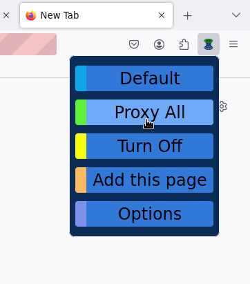
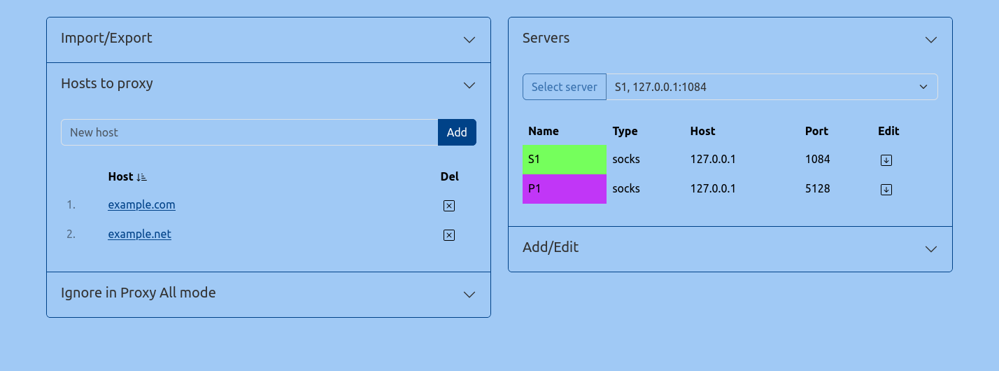

# WormholeProxy

Firefox Addon - single-list proxy manager. Made to be as simple as possible for non-tech users.    
Features:
- Sync config to Firefox
- Local import and export
- Local backup
- `Add this page` button

[Download](https://github.com/aceberg/WormholeProxy/releases/latest)

Menu             |  Options page
:-------------------------:|:-------------------------:
 | 

### Icon
<a href="https://www.flaticon.com/free-icons/wormhole" title="wormhole icons">Wormhole icons created by Umeicon - Flaticon</a>